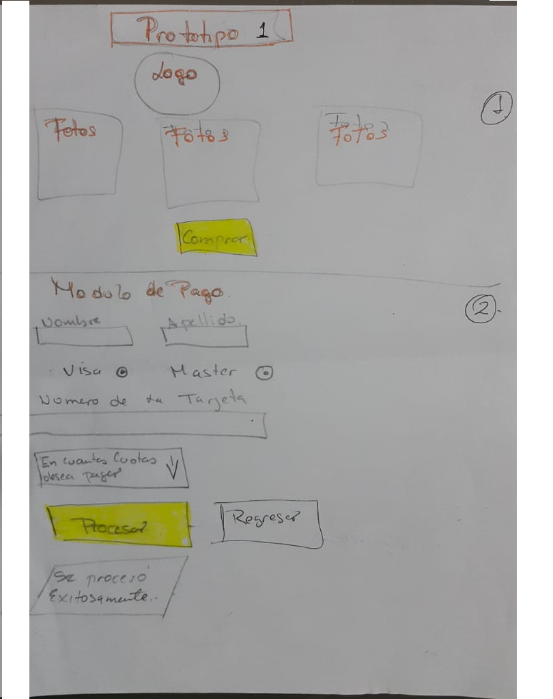
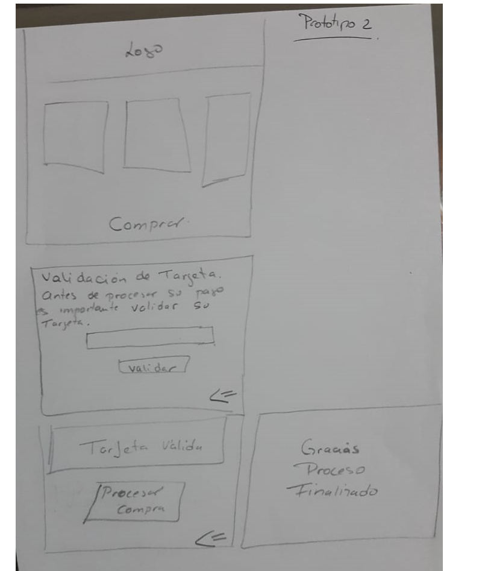

# Tarjeta de crédito válida

## Índice

* [1. Preámbulo](#1-Preámbulo)
* [2. Resumen del proyecto](#2-resumen-del-proyecto)
* [3. Prototipos](#3-Prototipos)
* [4. Producto Final](#4-Producto-Final)

## 1. Preámbulo

El proyecto consiste en crear una aplicacion web donde el cliente una vez realice su compra,
el sistema debera validar el número de la tarjeta,la validacion se generará aplicando algoritmo de Luhn.
El contexto que se utilizará es una tienda de camisetas estampadas .
## 2. Resumen del proyecto
  ## a. Descripción del usuario: 
         Los usuarios son personas que deseen comprar camisetas estampadas pero para realizar su compra deben validar su tarjeta de credito .
  ## b. Objetivos del Usuario:
        Comprar su camiseta utilizando como medio de pago tarjetas de credito.
  ## c. Como esta resolviendo el producto el problema:
  Se diseñará un módulo donde el cliente pueda visualizar las camisetas, luego deberá hacer click en boton comprar, automáticamente el sistema mostrará el módulo de validación, en donde el cliente deberá  ingrese el número de su terjeta con la que realizará su pago.
  El sistema automaticamente le indicará a través de un mensaje si es o no válida. Luego de dicha confirmación el cliente podra finalizar el proceso o validar otra tarjeta si asi lo desea.
### 3. Prototipos:
El prototipo fue diseñado pensando en una tienda online.
## a. Prototipo 1:
En el primer prototipo se crearon dos vistas. la primera donde el cliente visualiza las opciones de camisetas que puede seleccionar y comprar. La segunda vista  el cliente debia llenar un formulario con los siguientes datos: Nombre, Apellido, Seleccionat el tipo de tarjeta(Visa o master), seleccionar de una lista la cantidad de cuotas en la que desea pagar.
Finalizada la carga del formulario el cliente tiene la opcion de procesar o retornar.

## b. Prototipo 2 - Después del Feedback:
Finalizado el Feedback se realizaron los cambios tomando en cuenta las observaciones como:
1. Simplificar la interaccion tomando en cuenta el producto minimo requerido para que el aprendizaje fuera acorde con los objetivos planteados.

## 4. Producto Final.
El producto Final que se presenta varía de acuerdo al prototipo diseñado, puesto que el aprendizaje de algunos objetivos principalmente CSS se llevó mucho mas tiempo del previsto. Asi como aplicar y entender  la funcionalidad del DOM.

